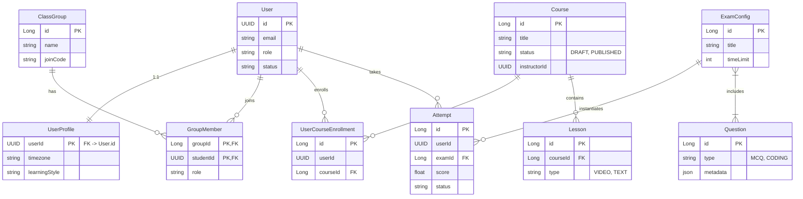

# Intelligent Tutoring System (ITS) - Microservices Backend

## 📖 Overview
This repository contains the backend microservices for the **Intelligent Tutoring System (ITS)**. The system is designed to provide a personalized learning experience, adaptive curriculum, and comprehensive management for students, instructors, and administrators.

## 🏗 System Architecture
The system follows a **Microservices Architecture** pattern, ensuring scalability, maintainability, and independent deployment of services.

### Polyglot Architecture & Integration (Java + Go)
The system leverages **Java (Spring Boot)** for complex business logic.
> **Note**: The **Chat Service** and **Notification Service** (Go), as well as the **Recommendation Engine** (Python), are hosted in separate repositories and are integrated via RabbitMQ/gRPC. This repository focuses on the **Java Microservices**.

#### Integration Pattern
- **Async Communication**: **RabbitMQ** for event-driven flows (Notifications, Gamification).
- **Sync Communication (Internal)**: **gRPC (Protobuf)** for high-performance inter-service communication.
- **Sync Communication (External)**: **REST API** for client-facing endpoints via API Gateway.
- **Authentication**: Shared **JWT (Keycloak)**.

#### Architecture Diagram (Java + Go + Python)
```mermaid
graph TD
    Client[Client Apps] -->|REST| Gateway[API Gateway :8888]
    
    subgraph "Java Cluster (Core Domain)"
        Gateway --> Identity[Identity Service]
        Gateway --> Course[Course Service]
        Gateway --> Assessment[Assessment Service]
        Gateway --> Profile[Profile Service]
    end

    subgraph "Go Cluster (Real-time)"
        Gateway --> Chat[Chat Service]
        Gateway --> Notification[Notification Service]
    end

    subgraph "Python Cluster (AI)"
        RecEngine[Recommendation Engine]
    end

    subgraph "Infrastructure"
        Broker[Message Broker (RabbitMQ)]
        Keycloak[Auth Server]
    end

    %% gRPC Connections
    Dashboard[Dashboard Service] -.->|gRPC| Course
    Dashboard -.->|gRPC| Profile
    Dashboard -.->|gRPC| Assessment
    Course -.->|gRPC| RecEngine
    
    %% Event Connections
    Course --"Event"--> Broker
    Assessment --"Event"--> Broker
    Broker --"Consume"--> Notification
```

### Standard Project Structure & SOLID Application
To ensure consistency and enforce SOLID principles, all services follow this package layout:

```text
com.its.<service_name>
├── config              # Configuration classes (Security, Swagger, etc.)
├── controller          # REST Controllers (SRP: Handle HTTP only)
├── dto                 # Data Transfer Objects (Separate API from Domain)
│   ├── request
│   └── response
├── entity              # JPA Entities (Rich Domain Model)
├── exception           # Global Exception Handling
├── mapper              # MapStruct interfaces (DIP: Decouple DTO/Entity)
├── repository          # Spring Data Repositories
├── service             # Business Logic Interfaces (DIP)
│   └── impl            # Service Implementations
└── client              # Feign/gRPC Clients (Adapter Pattern)
```

**SOLID in Action:**
- **OCP**: Use `Strategy` pattern in `service.impl` for varying logic (e.g., `GradingStrategy` in Assessment).
- **DIP**: Controllers inject `Service` interfaces, not classes.
- **ISP**: Large interfaces are split (e.g., `UserReader` vs `UserWriter`).

### RabbitMQ Topology & Event Contracts
We use a **Topic Exchange** model for flexibility.

#### 1. Exchange Configuration
- **Main Exchange**: `its.topic.exchange` (Type: `topic`, Durable: `true`)
- **DLX (Dead Letter Exchange)**: `its.dlx.exchange` (Type: `topic`, Durable: `true`)
    - **DLQ**: `q.dlx.all` (Binds to `its.dlx.exchange` with `#`)

#### 2. Event Catalog & Bindings
| Event Name | Routing Key | Queue Name | Publisher | Consumer | Purpose |
|------------|-------------|------------|-----------|----------|---------|
| `USER_REGISTERED` | `identity.user.registered` | `q.notification.welcome` | Identity | Notification (Go) | Send Welcome Email |
| `USER_REGISTERED` | `identity.user.registered` | `q.profile.create` | Identity | Profile (Java) | Create User Profile |
| `PASSWORD_RESET_REQ` | `identity.password.reset` | `q.notification.otp` | Identity | Notification (Go) | Send OTP Email |
| `COURSE_PUBLISHED` | `course.content.published` | `q.notification.course` | Course | Notification (Go) | Notify Followers |
| `LESSON_COMPLETED` | `course.lesson.completed` | `q.gamification.progress` | Course | Gamification (Go) | Update Leaderboard |
| `LESSON_COMPLETED` | `course.lesson.completed` | `q.dashboard.analytics` | Course | Dashboard (Java) | Update Risk Profile |
| `ASSIGNMENT_CREATED`| `course.assignment.created`| `q.notification.assignment` | Course | Notification (Go) | Notify Students |
| `EXAM_GRADED` | `assessment.exam.graded` | `q.gamification.xp` | Assessment | Gamification (Go) | Award XP/Badges |
| `EXAM_GRADED` | `assessment.exam.graded` | `q.profile.skill` | Assessment | Profile (Java) | Update Skill Level |
| `EXAM_GRADED` | `assessment.exam.graded` | `q.dashboard.analytics` | Assessment | Dashboard (Java) | Update Risk Profile |
| `GROUP_JOINED` | `profile.group.joined` | `q.course.enrollment` | Profile | Course (Java) | Auto-enroll in Group Courses |
| `EMAIL_VERIFY` | `identity.email.verify` | `q.notification.verify` | Identity | Notification (Go) | Send Verification Email |

#### 3. Consumer Reliability
- **Idempotency**: Consumers **MUST** check `X-Idempotency-Key` (UUID) in Redis (`processed_event:<uuid>`, TTL: 24h).
- **Retry Policy**:
    - **Initial**: 3 retries with exponential backoff (1s, 2s, 4s).
    - **Failure**: Reject (`requeue=false`) -> Routes to DLX -> `q.dlx.all`.
- **Ordering**: Per-entity ordering via Routing Key (e.g., `course.lesson.completed.<userId>`).

### gRPC Service Contracts
Internal communication uses **Protobuf v3**.

#### Proto Files & Generation
- **Location**: `src/main/proto` (within each service or a shared module).
- **Generation**: Run `mvn clean compile` to generate Java stubs via `protobuf-maven-plugin`.

#### 1. Course Service (`course.proto`)
- **GetCourseProgress**
    - *Request*: `user_id`, `course_id`
    - *Response*: `progress_percent`, `last_lesson_id`, `completed_lesson_ids[]`
- **GetCourseStructure**
    - *Request*: `course_id`
    - *Response*: Full tree of Chapters/Lessons for Recommendation Engine.

#### 2. Assessment Service (`assessment.proto`)
- **GetSkillMastery**
    - *Request*: `user_id`
    - *Response*: Map `<skill_name, mastery_level>` (0.0 - 1.0).
- **GetStudentScores**
    - *Request*: `user_id`, `course_id`
    - *Response*: List of `exam_id`, `score`, `grade`.

#### 3. User Profile Service (`profile.proto`)
- **GetUserProfile**
    - *Request*: `user_id`
    - *Response*: `timezone`, `learning_style`, `goals[]`.

### Core Services & Acceptance Criteria

#### 1. Identity Service (`identity-service`)
- **Role**: Auth & User Management.
- **Acceptance Criteria**:
    - Users can register/login and receive a valid JWT.
    - Password reset flow sends email and updates credentials securely.
    - Account locks after 5 failed attempts.

#### 2. User Profile Service (`user-profile-service`)
- **Role**: Extended user info & Group management.
- **Acceptance Criteria**:
    - Profile created automatically after registration.
    - Schedules handle Timezone conversion correctly.
    - Group members inherit permissions based on Role.

#### 3. Course Service (`course-service`)
- **Role**: Content & Curriculum.
- **Acceptance Criteria**:
    - Instructor can publish courses (Draft -> Published).
    - Adaptive rules redirect students based on score.
    - Events published to RabbitMQ on content changes.

#### 4. Assessment Service (`assessment-service`)
- **Role**: Exams & Grading.
- **Acceptance Criteria**:
    - Exams generated from Question Pools.
    - Auto-grading for MCQ; Manual review flag for Essays.
    - Grades published to Gradebook and Event Bus.

#### 5. Dashboard Service (`dashboard-service`)
- **Role**: Analytics Aggregator.
- **Acceptance Criteria**:
    - Loads Student Dashboard < 500ms via gRPC.
    - Accurately flags "At-Risk" students based on logic.

## 🚀 Prerequisites & How to Run
### Global Requirements
- **Java**: JDK 21
- **Maven**: 3.9+
- **Databases**: PostgreSQL 16, Redis 7
- **Message Broker**: RabbitMQ 3.12 (Management Plugin enabled)
- **Auth**: Keycloak 23 (Running on port 8080)
- **Service Registry**: Eureka Server (Running on port 8761)

### Quick Start
1. **Start Infrastructure**: `docker-compose up -d` (Postgres, RabbitMQ, Redis, Keycloak, Zipkin).
2. **Start Discovery Server**:
   ```bash
   cd backend/java-service/discovery-eureka-server
   mvn spring-boot:run
   ```
3. **Start Core Services**: Run `mvn spring-boot:run` in each service directory (Identity, Profile, Course, etc.).

### Service Communication Flows
The system uses a hybrid communication model to balance consistency and performance.

#### 1. Synchronous (gRPC) - "Read-Heavy / Real-Time"
Used when immediate data is required for a UI response.
-   **Dashboard Aggregation**: The `dashboard-service` acts as an aggregator. When a user loads their dashboard:
    -   Calls `course-service` (gRPC) to get current progress and next lesson.
    -   Calls `assessment-service` (gRPC) to get recent exam scores and skill mastery.
    -   Calls `user-profile-service` (gRPC) to get timezone and learning preferences.
    -   *Fallback*: If a service is down, the dashboard returns partial data (e.g., empty skill chart) rather than crashing.

#### 2. Asynchronous (RabbitMQ) - "Write-Heavy / Side Effects"
Used for decoupling core logic from side effects.
-   **User Onboarding**: `identity-service` (Register) -> Event `USER_REGISTERED` -> `user-profile-service` (Create Profile) + `notification-service` (Send Welcome Email).
-   **Group Enrollment**: `user-profile-service` (Join Group) -> Event `GROUP_JOINED` -> `course-service` (Auto-Enroll in Group Courses).
-   **Progress Tracking**: `course-service` (Complete Lesson) -> Event `LESSON_COMPLETED` -> `gamification-service` (Award Points) + `dashboard-service` (Update Risk Model).
-   **Grading**: `assessment-service` (Grade Exam) -> Event `EXAM_GRADED` -> `profile-service` (Update Skill Level) + `dashboard-service` (Update Risk Model).

## 🗄 Consolidated Data Model (ERD)
> **Note**: This is a simplified high-level ERD. For detailed schema definitions, please refer to the specific README of each service.

The following diagram represents the core entities across all microservices and their logical relationships.



## 📚 Service Documentation References
For detailed API specifications, internal architecture, and setup guides, refer to the individual service READMEs.

| Service | Directory | Key Features | API Docs |
|:--------|:----------|:-------------|:---------|
| **Identity** | [identity-service](./identity-service/README.md) | Auth, JWT, RBAC, Keycloak Integration | (TODO) |
| **User Profile** | [user-profile-service](./user-profile-service/README.md) | Profiles, Groups, Schedules | (TODO) |
| **Course** | [course-service](./course-service/README.md) | Curriculum, Lessons, Assignments | (TODO) |
| **Assessment** | [assessment-service](./assessment-service/README.md) | Exams, Question Bank, Auto-Grading | (TODO) |
| **Dashboard** | [dashboard-service](./dashboard-service/README.md) | Analytics, Risk Prediction, Aggregation | (TODO) |
| **API Gateway** | [api-gateway](./api-gateway/README.md) | Routing, Rate Limiting, Circuit Breaker | N/A |
| **Discovery (Eureka)** | [discovery-eureka-server](./discovery-eureka-server/README.md) | Service Registry (Eureka) | N/A |


## 🤝 Contribution
1. Fork the repository.
2. Create a feature branch (`git checkout -b feature/AmazingFeature`).
3. Commit your changes (`git commit -m 'Add some AmazingFeature'`).
4. Push to the branch (`git push origin feature/AmazingFeature`).
5. Open a Pull Request.
