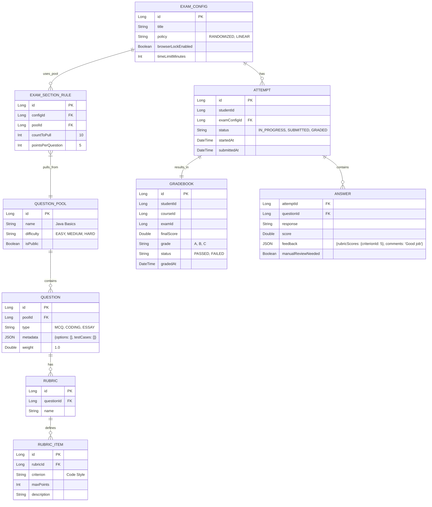

# Assessment Service
Chưa xong CRUD theo use case MVP. assessment-service có skeleton đầy đủ lớp/entity/controller, nhưng còn nhiều khoảng trống so với flow đã mô tả:

Thiếu endpoint/logic chủ chốt: Không có manual grade (PUT /attempts/{id}/grade), cancel attempt, gradebook filter theo lesson/student (chỉ có course-level), chưa có mapping quiz vào lesson/lesson completion event. Không có danh sách attempt pending review cho teacher. Không emit assessment.exam.graded.
Grading/attempt còn sơ khai: AttemptServiceImpl chỉ chấm MCQ bằng cách so sánh metadata.correct với response (không parse JSON options/testcases, không time limit/window, không check “already submitted” vs timeout), essay chỉ đánh dấu review nhưng không có quy trình review. Không có xử lý IN_PROGRESS → SUBMITTED → GRADED đầy đủ hoặc tính pass/fail chuẩn (status hardcode “PASSED”). Không kiểm tra chủ sở hữu course/lesson khi tạo exam/pool/question.
Security/context: Các controller không kiểm tra role/ownership; lấy userId bằng SecurityContextHolder.getContext().getAuthentication().getName() hoặc random fallback (vd. AttemptServiceImpl#getCurrentUserId, GradebookServiceImpl#getCurrentUserId), không parse từ JWT claim sub. Điều này không đáp ứng Student/Teacher/Admin phân quyền.
Data model lệch nhẹ với plan: ExamConfig đã có lessonId/courseId, nhưng migrations V1/V2 chưa thêm courseId/lessonId mới (V1 có lesson_id, course_id chưa; V2 cần kiểm tra), không có UNIQUE lessonId (1 lesson 1 quiz) hay ràng buộc window/time limit. Không có bảng audit/manual review queue. Không có bảng/logic partial credit rubric áp dụng.
Validation/health: Health /health ok; nhưng request validation rất ít (metadata schema, time window, points per question, count to pull chưa check). Rate limit/RBAC chưa có. Không có publish event sang RabbitMQ.
Kết luận: assessment-service chưa hoàn thiện CRUD/flow theo use case MVP; cần bổ sung endpoint và logic start/submit/grade (MCQ tối thiểu), manual review, gradebook, mapping lesson, event emit, kiểm tra role/owner, và chuẩn hóa userId từ JWT.

## 📝 Overview
The **Assessment Service** is a specialized domain responsible for managing question banks, generating quizzes/exams, and executing grading logic. It supports complex assessment types like coding challenges and adaptive testing.

> **📋 API Specification**: For detailed endpoint specifications, request/response examples, and validation rules, see [Assessment Service API Plan](../../../plan/assessment-service-api.md).

## 🏗 Architecture & Design
This service handles high-throughput exam submissions and complex grading algorithms.

### Communication Protocols
- **gRPC Server**: Exposes student scores and skill mastery data to the **Dashboard Service**.
    - *Service Definition*: `AssessmentService.proto` (GetStudentScores, GetSkillMastery).
- **REST**: For taking exams and submitting answers.

### Design Patterns & SOLID

#### 1. Chain of Responsibility (Grading Pipeline)
*Problem*: Grading involves multiple steps: Syntax Check -> Test Cases -> Plagiarism Check -> Score Calculation.
*Solution*: Link these steps in a chain.
```java
public abstract class GradingStep {
    protected GradingStep next;
    public abstract void process(Submission s);
}
// SyntaxCheckStep -> TestCaseStep -> SecurityCheckStep
```

#### 2. Factory Method (Question Generation)
*Problem*: Creating different question objects from raw DB data.
*Solution*: `QuestionFactory` to instantiate `MCQQuestion`, `CodingQuestion`, etc.

### Project Structure & SOLID (Grading Engine)
We use the **Chain of Responsibility** for grading and **Factory Pattern** for question creation.

```text
com.its.assessment
├── engine
│   ├── GradingEngine.java       # Facade for the grading process
│   └── chain                    # CHAIN OF RESPONSIBILITY
│       ├── GradingStep.java
│       ├── SyntaxCheckStep.java
│       ├── UnitTestStep.java
│       └── PlagiarismStep.java
├── factory                      # FACTORY PATTERN
│   ├── QuestionFactory.java
│   └── impl
│       ├── MCQFactory.java
│       └── CodingFactory.java
└── service
    └── AssessmentService.java
```

**SOLID Proof:**
- **OCP**: Add `SecurityScanStep` to the grading chain configuration without touching `GradingEngine`.
- **LSP**: All `QuestionFactory` implementations return a valid `Question` object that behaves consistently.

### Event Contract: `EXAM_GRADED`
**Exchange**: `its.topic.exchange` | **Routing Key**: `assessment.exam.graded`
```json
{
  "eventId": "evt_456",
  "timestamp": "2025-11-23T12:30:00Z",
  "payload": {
    "attemptId": "a789",
    "studentId": "u123",
    "examId": "e55",
    "score": 85.5,
    "passed": true,
    "skillsEarned": [
      { "skill": "Java", "points": 10 }
    ]
  }
}
```

### Grading Lifecycle & Logic
1.  **Attempt Started**: Status `IN_PROGRESS`. Timer starts.
2.  **Submission**: Status `SUBMITTED`.
3.  **Auto-Grading**:
    - **MCQ**: Instant check against key.
    - **Coding**: Sent to Judge0 (Sandbox).
    - **Essay**: Marked `manualReviewNeeded=true`.
4.  **Partial Credit**:
    - **Rubric**: Sum of points for met criteria.
    - **Coding**: % of passed test cases.
5.  **Finalization**: Status `GRADED` only when ALL questions scored.

### RabbitMQ Bindings & Events
| Event         | Exchange             | Routing Key              | Queue (Consumer)         | DLX/DLQ                           |
| ------------- | -------------------- | ------------------------ | ------------------------ | --------------------------------- |
| `EXAM_GRADED` | `its.topic.exchange` | `assessment.exam.graded` | `q.gamification.xp` (Go) | `its.dlx.exchange` -> `q.dlx.all` |
| `EXAM_GRADED` | `its.topic.exchange` | `assessment.exam.graded` | `q.profile.skill` (Java) | `its.dlx.exchange` -> `q.dlx.all` |

### Acceptance Criteria & Flows
- **Exam Attempt**:
    - Student starts exam -> `ATTEMPT` created (`IN_PROGRESS`).
    - Student submits -> Status `SUBMITTED`.
    - **Success**: Timer stops; Answers saved.
- **Grading**:
    - Auto-grader runs for MCQ.
    - **Success**: Score calculated; `EXAM_GRADED` event emitted (if no manual review needed).
- **Manual Review**:
    - Essay question present -> `ANSWER` marked `manualReviewNeeded`.
    - **Success**: Instructor grades essay -> Final score updated -> Event emitted.

### gRPC Service Methods (`AssessmentService.proto`)
1.  `GetStudentScores(userId, courseId)`: Returns list of exam scores.
    - **Response**: List of `{ exam_id, score, grade, passed }`.
2.  `GetSkillMastery(userId)`: Returns aggregated skill levels based on tagged questions.
    - **Response**: Map `<skill_name, mastery_level>` (0.0 - 1.0).

### API Specifications & Rules

#### 1. Quiz <-> Lesson Mapping
- **Relation**: 1-to-1 Mapping via `ExamConfig`.
- **Field**: `ExamConfig.lessonId` (Nullable). If set, this Exam acts as a Lesson Quiz.
- **Constraint**: A Lesson can have at most 1 Quiz.

#### 2. Teacher View (Gradebook)
- **Endpoint**: `GET /api/v1/gradebook/courses/{courseId}`
- **Role**: `TEACHER` (Owner).
- **Params**: `?lessonId=...&studentId=...&page=0`.
- **Response**:
  ```json
  {
    "content": [
      { "studentId": "u1", "examId": 101, "score": 85.0, "status": "GRADED" }
    ]
  }
  ```

#### 3. Attempt Lifecycle
- **Start**: `POST /exams/{configId}/start` -> Returns `{ attemptId, questions: [...] }`.
- **Submit**: `POST /attempts/{id}/submit` -> Payload `{ answers: [{ qId: 1, response: "A" }] }`.
- **Result**: `GET /attempts/{id}/result` -> Returns `{ score, feedback, passed }`.
- **Error Codes**:
    - `EXAM_TIMEOUT`: If submission is after `startedAt + timeLimit`.
    - `ALREADY_SUBMITTED`: If status is not `IN_PROGRESS`.

### Entity Relationship Diagram (ERD)
Reflecting **Gradebook**, **Rubrics**, and **Pool Policies**.



## 🔑 Key Features
- **Question Bank**: Centralized repository of questions tagged by skill/difficulty.
- **Randomized Exams**: Generate unique exams by pulling random questions from pools.
- **Auto-Grading**: Immediate feedback for objective questions (MCQ, Fill-in-blank).
- **Code Execution**: Integration with a sandbox (e.g., Judge0) for coding problems.
- **Gradebook**: Persistent record of all student scores.

## 🔗 Service Dependencies
- **Course Service**: Links assessments to specific lessons or milestones.
- **User Profile Service**: Updates student skill levels based on results.
