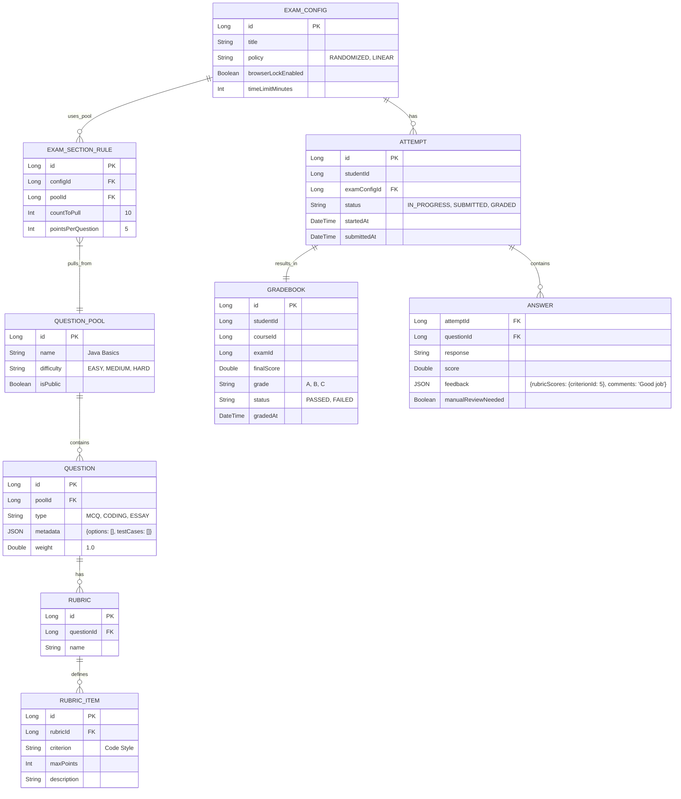

# Assessment Service

## 📝 Overview
The **Assessment Service** is a specialized domain responsible for managing question banks, generating quizzes/exams, and executing grading logic. It supports complex assessment types like coding challenges and adaptive testing.

## 🏗 Architecture & Design
This service handles high-throughput exam submissions and complex grading algorithms.

### Communication Protocols
- **gRPC Server**: Exposes student scores and skill mastery data to the **Dashboard Service**.
    - *Service Definition*: `AssessmentService.proto` (GetStudentScores, GetSkillMastery).
- **REST**: For taking exams and submitting answers.

### Design Patterns & SOLID

#### 1. Chain of Responsibility (Grading Pipeline)
*Problem*: Grading involves multiple steps: Syntax Check -> Test Cases -> Plagiarism Check -> Score Calculation.
*Solution*: Link these steps in a chain.
```java
public abstract class GradingStep {
    protected GradingStep next;
    public abstract void process(Submission s);
}
// SyntaxCheckStep -> TestCaseStep -> SecurityCheckStep
```

#### 2. Factory Method (Question Generation)
*Problem*: Creating different question objects from raw DB data.
*Solution*: `QuestionFactory` to instantiate `MCQQuestion`, `CodingQuestion`, etc.

### Project Structure & SOLID (Grading Engine)
We use the **Chain of Responsibility** for grading and **Factory Pattern** for question creation.

```text
com.its.assessment
├── engine
│   ├── GradingEngine.java       # Facade for the grading process
│   └── chain                    # CHAIN OF RESPONSIBILITY
│       ├── GradingStep.java
│       ├── SyntaxCheckStep.java
│       ├── UnitTestStep.java
│       └── PlagiarismStep.java
├── factory                      # FACTORY PATTERN
│   ├── QuestionFactory.java
│   └── impl
│       ├── MCQFactory.java
│       └── CodingFactory.java
└── service
    └── AssessmentService.java
```

**SOLID Proof:**
- **OCP**: Add `SecurityScanStep` to the grading chain configuration without touching `GradingEngine`.
- **LSP**: All `QuestionFactory` implementations return a valid `Question` object that behaves consistently.

### Event Contract: `EXAM_GRADED`
**Exchange**: `its.topic.exchange` | **Routing Key**: `assessment.exam.graded`
```json
{
  "eventId": "evt_456",
  "timestamp": "2025-11-23T12:30:00Z",
  "payload": {
    "attemptId": "a789",
    "studentId": "u123",
    "examId": "e55",
    "score": 85.5,
    "passed": true,
    "skillsEarned": [
      { "skill": "Java", "points": 10 }
    ]
  }
}
```

### Grading Lifecycle & Logic
1.  **Attempt Started**: Status `IN_PROGRESS`. Timer starts.
2.  **Submission**: Status `SUBMITTED`.
3.  **Auto-Grading**:
    - **MCQ**: Instant check against key.
    - **Coding**: Sent to Judge0 (Sandbox).
    - **Essay**: Marked `manualReviewNeeded=true`.
4.  **Partial Credit**:
    - **Rubric**: Sum of points for met criteria.
    - **Coding**: % of passed test cases.
5.  **Finalization**: Status `GRADED` only when ALL questions scored.

### RabbitMQ Bindings & Events
| Event | Exchange | Routing Key | Queue (Consumer) | DLX/DLQ |
|-------|----------|-------------|------------------|---------|
| `EXAM_GRADED` | `its.topic.exchange` | `assessment.exam.graded` | `q.gamification.xp` (Go) | `its.dlx.exchange` -> `q.dlx.all` |
| `EXAM_GRADED` | `its.topic.exchange` | `assessment.exam.graded` | `q.profile.skill` (Java) | `its.dlx.exchange` -> `q.dlx.all` |

### Acceptance Criteria & Flows
- **Exam Attempt**:
    - Student starts exam -> `ATTEMPT` created (`IN_PROGRESS`).
    - Student submits -> Status `SUBMITTED`.
    - **Success**: Timer stops; Answers saved.
- **Grading**:
    - Auto-grader runs for MCQ.
    - **Success**: Score calculated; `EXAM_GRADED` event emitted (if no manual review needed).
- **Manual Review**:
    - Essay question present -> `ANSWER` marked `manualReviewNeeded`.
    - **Success**: Instructor grades essay -> Final score updated -> Event emitted.

### gRPC Service Methods (`AssessmentService.proto`)
1.  `GetStudentScores(userId, courseId)`: Returns list of exam scores.
2.  `GetSkillMastery(userId)`: Returns aggregated skill levels based on tagged questions.

### Entity Relationship Diagram (ERD)
Reflecting **Gradebook**, **Rubrics**, and **Pool Policies**.



## 🔑 Key Features
- **Question Bank**: Centralized repository of questions tagged by skill/difficulty.
- **Randomized Exams**: Generate unique exams by pulling random questions from pools.
- **Auto-Grading**: Immediate feedback for objective questions (MCQ, Fill-in-blank).
- **Code Execution**: Integration with a sandbox (e.g., Judge0) for coding problems.
- **Gradebook**: Persistent record of all student scores.

## 🔗 Service Dependencies
- **Course Service**: Links assessments to specific lessons or milestones.
- **User Profile Service**: Updates student skill levels based on results.
