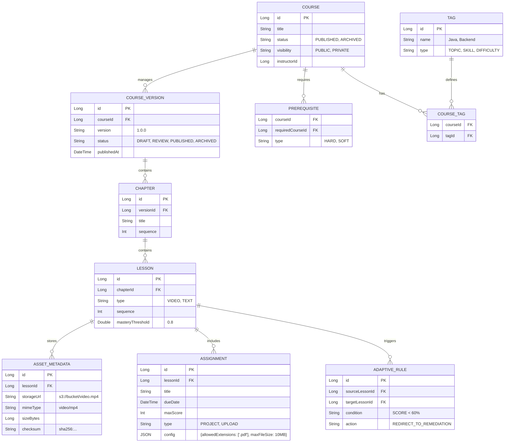

# Course Service
Hiện có CRUD cơ bản cho Course/Chapter/Lesson (+ health controller) qua các controller/service: CourseController, ChapterController, LessonController (ví dụ backend/java-service/course-service/src/main/java/ITS/com/vn/course_service/service/CourseService.java). Không có API enroll/unenroll, hoàn thành lesson, publish flow với event, hay assignment/quiz binding. Student view/complete lesson và Teacher xem enroll/điểm quiz chưa có.
Entity/repo chỉ cover Course/Version/Chapter/Lesson/Tag/Prerequisite/...; không có Enrollment, UserLessonProgress, CourseVersion publish snapshot, hay mapping quiz/assignment theo plan. Flyway V2 đã drop user_course_enrollment và prerequisites (old schema) nhưng chưa có bảng progress/enrollment phù hợp use case.
Endpoint publish/archvie chỉ đổi trạng thái, có TODO emit event, chưa kiểm tra chapter/lesson điều kiện nâng cao; check quyền dựa trên sub parse Long (JWT sub theo plan là UUID) → sẽ fail hoặc sai user-id (CourseController.extractUserIdFromAuth, ChapterController, LessonController).
Lacking Student flows: không có GET /courses/{id}/enrollments, POST /courses/{id}/enroll, DELETE /courses/{id}/enroll, POST /lessons/{id}/complete, không có prerequisite check, không gắn quiz (Assessment) hay assignment creation endpoint.
Health: có /api/v1/health controller, actuator đã khai báo trong pom, ok cho basic check.
Kết luận: course-service chưa “code xong CRUD” cho MVP use case. Mới có CRUD Course/Chapter/Lesson cho giảng viên, thiếu enroll/progress/lesson completion và event integration; cần bổ sung entity/repo/controller/service cho Enrollment/Progress và endpoints theo plan, sửa JWT userId (UUID), và phát sự kiện publish/lesson completed.

## 📚 Overview
The **Course Service** manages the curriculum, content delivery, and structural organization of learning materials. It supports advanced features like versioning, tagging, and prerequisites.

> **📋 API Specification**: For detailed endpoint specifications, request/response examples, and validation rules, see [Course Service API Plan](../../../plan/course-service-api.md).

## 🏗 Architecture & Design
We use **Domain-Driven Design (DDD)** to model complex interactions.

### Communication Protocols
- **REST**: For standard CRUD operations (Instructor managing content).
- **gRPC Server**: Exposes course metadata and structure to internal consumers (Dashboard, Recommendation Engine).
    - *Service Definition*: `CourseService.proto` (GetCourseDetails, GetLessonStructure).
- **RabbitMQ**: Publishes domain events.

### Design Patterns & SOLID

#### 1. Strategy Pattern (Content & Question Types)
*Problem*: We have multiple lesson types (Video, Text) and question types (MCQ, Coding), each with different validation and rendering logic.
*Solution*: Define a strategy interface.
```java
// Strategy Interface
public interface QuestionHandler {
    boolean validateAnswer(Question question, AnswerSubmission submission);
    int calculateScore(Question question, AnswerSubmission submission);
}

// Concrete Strategies
@Component("MCQ")
public class MCQHandler implements QuestionHandler { ... }

@Component("CODING")
public class CodingHandler implements QuestionHandler { ... }

// Context
public class GradingService {
    private final Map<String, QuestionHandler> handlers;
    
    public int grade(Question q, AnswerSubmission a) {
        return handlers.get(q.getType()).calculateScore(q, a);
    }
}
```

### Project Structure & SOLID (Content & Adaptive Logic)
We use the **Strategy Pattern** for content types and **Specification Pattern** for adaptive rules.

```text
com.its.course
├── controller
│   └── CourseController.java
├── service
│   ├── CourseService.java
│   ├── content                  # STRATEGY PATTERN (Video, Quiz, Text)
│   │   ├── ContentHandler.java
│   │   ├── VideoHandler.java
│   │   └── QuizHandler.java
│   └── adaptive                 # SPECIFICATION PATTERN (Rules)
│       ├── AdaptiveRule.java
│       ├── ScoreCondition.java
│       └── CompletionCondition.java
└── repository
    └── CourseRepository.java
```

**SOLID Proof:**
- **OCP**: Add `CodingExerciseHandler` to `service.content` to support new lesson types.
- **SRP**: `AdaptiveRule` classes only define logic for checking conditions, not executing transitions.

### Event Contract: `COURSE_PUBLISHED`
**Exchange**: `its.topic.exchange` | **Routing Key**: `course.content.published`
```json
{
  "eventId": "evt_123",
  "timestamp": "2025-11-23T10:00:00Z",
  "payload": {
    "courseId": "c1",
    "title": "Advanced Java",
    "instructorId": "i99",
    "tags": ["Java", "Backend"],
    "version": "1.0.0"
  }
}
```

### Adaptive Policy & Mastery Learning
- **Mastery Threshold**: Default **80%**.
    - If `score < 80%`:
        - Status: `NEEDS_REMEDIATION`.
        - Action: Unlock `REMEDIATION` content -> Require Re-attempt.
    - If `score >= 80%`:
        - Status: `COMPLETED`.
        - Action: Unlock Next Lesson.
    - If `score >= 95%`:
        - Action: Offer **Challenge** (Skip next lesson or advanced content).

### RabbitMQ Bindings & Events
| Event                    | Exchange             | Routing Key                 | Queue (Consumer)                 | DLX/DLQ                           |
| ------------------------ | -------------------- | --------------------------- | -------------------------------- | --------------------------------- |
| `COURSE_PUBLISHED`       | `its.topic.exchange` | `course.content.published`  | `q.notification.course` (Go)     | `its.dlx.exchange` -> `q.dlx.all` |
| `LESSON_COMPLETED`       | `its.topic.exchange` | `course.lesson.completed`   | `q.gamification.progress` (Go)   | `its.dlx.exchange` -> `q.dlx.all` |
| `ASSIGNMENT_CREATED`     | `its.topic.exchange` | `course.assignment.created` | `q.notification.assignment` (Go) | `its.dlx.exchange` -> `q.dlx.all` |
| `GROUP_JOINED` (Consume) | `its.topic.exchange` | `profile.group.joined`      | `q.course.enrollment` (Java)     | `its.dlx.exchange` -> `q.dlx.all` |

### Acceptance Criteria & Flows
- **Course Publishing**:
    - Instructor changes status `DRAFT` -> `PUBLISHED`.
    - **Success**: `COURSE_PUBLISHED` event emitted; Course visible in Catalog.
- **Adaptive Progression**:
    - Student completes Lesson A with score < 80%.
    - **Success**: Next lesson remains locked; Remediation content unlocked.
- **Assignment Creation**:
    - Instructor creates Assignment.
    - **Success**: `ASSIGNMENT_CREATED` event emitted; Notification received by enrolled students.

### gRPC Service Methods (`CourseService.proto`)
1.  `GetCourseDetails(courseId)`: Returns metadata, tags, and instructor info.
2.  `GetLessonStructure(courseId)`: Returns hierarchical tree (Chapters -> Lessons) for Recommendation Engine.
3.  `GetCourseProgress(userId, courseId)`: Returns completion % and last accessed lesson.
    - **Response**: `progress_percent` (int32), `last_lesson_id` (int64), `completed_lesson_ids` (repeated int64).

### API Specifications & Rules

#### 1. Lesson Management
- **Endpoint**: `GET /api/v1/lessons/{id}`
- **Response**:
  ```json
  {
    "id": 101,
    "title": "Intro to Streams",
    "type": "VIDEO",
    "asset": { "url": "...", "mime": "video/mp4" },
    "masteryThreshold": 0.8,
    "isCompleted": true, // Computed for current user
    "nextLessonId": 102
  }
  ```
- **Completion Rule**:
    - **Video**: Watch > 90% duration (Client sends heartbeat).
    - **Quiz**: Score >= `masteryThreshold`.
    - **Failure**: Return `422 Unprocessable Entity` (Code: `PREREQ_NOT_MET`) if prereqs not done.

#### 2. Chapter Management
- **Endpoints**:
    - `POST /api/v1/courses/{id}/chapters`: Create Chapter.
    - `PUT /api/v1/courses/{id}/chapters/reorder`: Reorder.
    - **Payload**: `{ "chapterIds": [1, 3, 2] }`

#### 3. Enrollment & Progress
- **Endpoint**: `GET /api/v1/courses/{id}/enrollments`
    - **Role**: `TEACHER` (Owner), `ADMIN`.
    - **Params**: `?page=0&sort=enrolledAt,desc`.
- **Publish Rule**: Course must have >= 1 Chapter & >= 1 Lesson to transition `DRAFT` -> `PUBLISHED`.

### Entity Relationship Diagram (ERD)
Reflecting **Full Content Model** including Tags, Prerequisites, and Assignments.



## 🔗 Service Dependencies
- **Identity Service**: Validates instructor permissions.
- **Assessment Service**: Delegates quiz grading and question bank management.
- **MinIO/S3**: Stores video and file assets.

## 🔑 Key Features
- **Content Management**: Create/Edit courses, chapters, lessons.
- **Versioning**: Support for multiple versions of a course.
- **Assessments**: Manage quizzes and assignments.
- **Tagging**: Categorize content by topic, difficulty, and skills.

## 🛠 Tech Stack
- **Framework**: Spring Boot 3.5.x
- **Database**: PostgreSQL
- **Storage**: MinIO / S3 (for video/file storage - planned)
- **Communication**: REST / RabbitMQ
