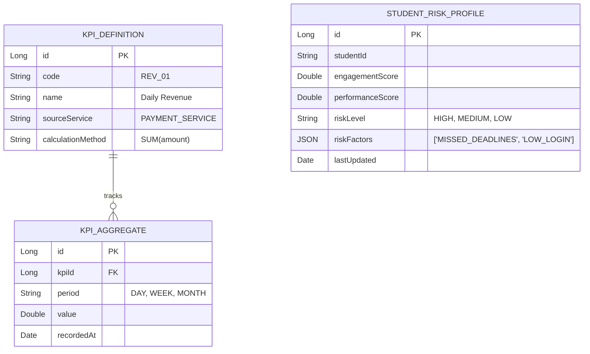

# Dashboard Service

## 📊 Overview
The **Dashboard Service** is an aggregation service responsible for collecting, processing, and presenting data to students, instructors, and administrators. It powers the analytics and reporting features.

## 🏗 Architecture & Design
This service acts as an **Aggregator** or **BFF (Backend for Frontend)** helper. It gathers data from multiple sources to provide a unified view.

### Communication Protocols
- **gRPC**: Used for high-performance, low-latency data fetching from **Course**, **Profile**, and **Assessment** services.
    - *Why?* Dashboard loads require querying multiple services simultaneously. gRPC with Protobuf ensures smaller payload sizes and faster serialization than REST.
- **REST**: Exposes aggregated data to the frontend.

### Data Aggregation & KPIs
- **Student View**:
    - *Completion Rate*: % of assigned courses completed.
    - *Skill Radar*: Visualization of strengths/weaknesses (from Assessment Service).
    - *Upcoming Deadlines*: Aggregated from Course/Assignment schedules.
- **Instructor View**:
    - *Class Average*: Mean score per assignment.
    - *At-Risk Students*: List of students with low engagement or failing grades (Logic: `last_login > 7 days` OR `avg_score < 50`).
- **Admin View**:
    - *System Health*: Active users, error rates (from Actuator/Micrometer).
    - *Revenue/Enrollment*: Total signups per month.

### Data Contracts (gRPC)
The Dashboard Service consumes specific messages from other domains:
- **From Course Service**: `GetCourseProgress(userId)` -> Returns `{ courseId, %complete, lastAccess }`.
- **From Assessment Service**: `GetSkillMastery(userId)` -> Returns `{ [skill: "Java", level: 0.8] }`.
- **From Profile Service**: `GetLearningGoals(userId)` -> Returns `{ goals: ["Backend", "DevOps"] }`.

### Project Structure & SOLID (Aggregation & Risk)
We use the **Facade Pattern** for data aggregation and **Strategy Pattern** for risk analysis.

```text
com.its.dashboard
├── aggregator                   # FACADE PATTERN
│   ├── StudentDashboardFacade.java
│   └── InstructorDashboardFacade.java
├── client                       # Feign Clients (Course, Assessment)
│   ├── CourseClient.java
│   └── AssessmentClient.java
├── service
│   └── risk                     # STRATEGY PATTERN
│       ├── RiskAnalyzer.java
│       ├── EngagementRule.java
│       └── PerformanceRule.java
└── controller
    └── DashboardController.java
```

**SOLID Proof:**
- **ISP**: `StudentDashboardFacade` only exposes methods relevant to students, keeping the interface clean.
- **DIP**: `RiskAnalyzer` depends on `RiskRule` interface, allowing dynamic addition of new risk factors.

### KPI & At-Risk Acceptance Criteria
- **KPI: Engagement Drop**:
    - *Criteria*: Flag if `last_login > 7 days` AND `course_access_count < 2 (current_week)`.
    - *Action*: Add to `High Risk` list; Instructor alerted.
- **KPI: Performance Dip**:
    - *Criteria*: Flag if `avg_score < 50%` (rolling last 3 assignments) OR `failed_exams > 1`.
- **KPI: Deadline Miss**:
    - *Criteria*: Flag if `missed_deadlines > 2` consecutive.

### Data Sources & Refresh Strategy
| Metric | Source Service | Method/Event | Refresh Strategy | Fallback |
|--------|----------------|--------------|------------------|----------|
| **Course Progress** | Course Service | gRPC `GetCourseProgress` | **Real-time** | Return Cached/Empty |
| **Skill Mastery** | Assessment Service | gRPC `GetSkillMastery` | **Real-time** | Return Cached/Empty |
| **Learning Goals** | Profile Service | gRPC `GetUserProfile` | **Cached** (TTL 1h) | Return Default |
| **Revenue** | Payment Service | Event `payment.success` | **Async Aggregate** | N/A |

- **gRPC Fallback**: If upstream service is down, return stale data from Redis or empty default to prevent Dashboard crash.

### Entity Relationship Diagram (ERD)
Reflecting **Aggregated Analytics**, **Risk Profiling**, and **Data Sources**.



## 🔗 Service Dependencies
- **Course Service**: Fetches course structure and completion data.
- **User Profile Service**: Fetches user details.
- **Identity Service**: Fetches role information.

## 🔑 Key Features
- **Student Dashboard**: Progress tracking, upcoming deadlines, recommendations.
- **Instructor Dashboard**: Class performance, at-risk student alerts.
- **Admin Dashboard**: System usage stats, active users.
- **Reporting**: Export data to CSV/PDF.

## 🛠 Tech Stack
- **Framework**: Spring Boot 3.5.x
- **Database**: PostgreSQL (for caching stats) / Redis
- **Communication**: Feign Client (Sync), RabbitMQ (Async events)
