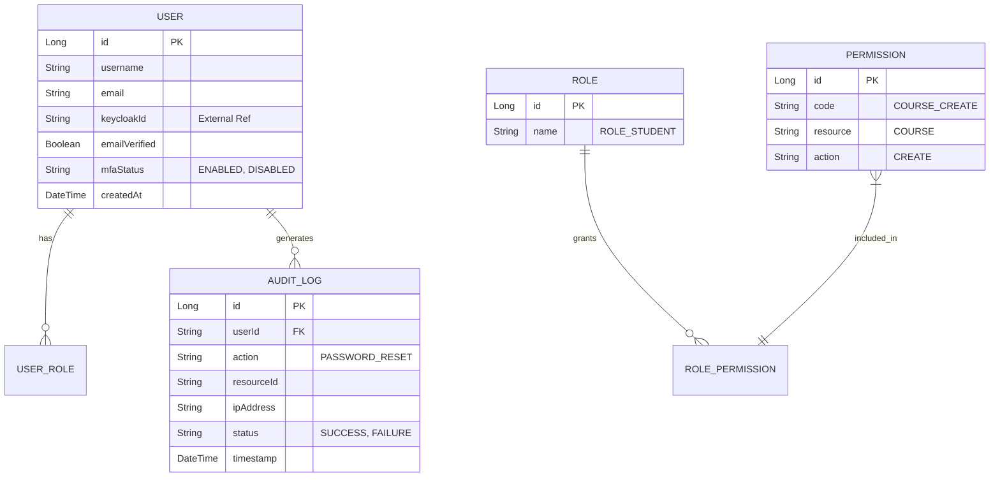

# Identity Service

## 🆔 Overview
The **Identity Service** is the backbone of security in the ITS ecosystem. It handles user registration, authentication (delegated to Keycloak), and identity management.

## 🏗 Architecture & Design
This service follows a **Layered Architecture**:
- **Controller Layer**: Handles HTTP requests and input validation.
- **Service Layer**: Contains business logic (e.g., syncing with Keycloak, token management).
- **Repository Layer**: Abstraction for database interactions.

### Design Patterns & SOLID
We employ specific patterns to ensure decoupling and scalability:

#### 1. Adapter Pattern (Keycloak Integration)
*Problem*: We rely on Keycloak today, but might switch to another provider (e.g., Auth0) later.
*Solution*: Use an `IdentityProvider` interface.
```java
// Interface
public interface IdentityProvider {
    String createUser(UserRegistrationDto dto);
    void deleteUser(String id);
}

// Implementation (Adapter)
@Service
public class KeycloakAdapter implements IdentityProvider {
    private final Keycloak keycloakClient;
    // ... implements methods using Keycloak SDK
}
```

#### 2. Event-Driven Architecture (Observer Pattern)
*Problem*: When a user registers, we need to create a profile in `user-profile-service` and send a welcome email.
*Solution*: Publish an event (`UserRegisteredEvent`) instead of direct coupling.
```java
// Publisher
public void registerUser(UserDto dto) {
    User user = repository.save(mapper.toEntity(dto));
    eventPublisher.publishEvent(new UserRegisteredEvent(user.getId(), user.getEmail()));
}
```

### Project Structure & SOLID (Auth Adapter & Policies)
We use the **Adapter Pattern** for Identity Providers and **Strategy Pattern** for Security Policies.

```text
com.its.identity
├── config
│   └── SecurityConfig.java      # OAuth2 Resource Server config
├── controller
│   └── AuthController.java      # Endpoints: /login, /register, /refresh
├── service
│   ├── AuthService.java         # Core logic
│   ├── provider                 # ADAPTER PATTERN (Keycloak, Auth0)
│   │   ├── IdentityProvider.java
│   │   └── KeycloakProvider.java
│   └── policy                   # STRATEGY PATTERN (Lockout, Password)
│       ├── SecurityPolicy.java
│       ├── AccountLockoutPolicy.java
│       └── PasswordComplexityPolicy.java
└── event
    └── UserRegisteredEvent.java # Domain Event
```

**SOLID Proof:**
- **OCP**: Add `MfaPolicy.java` to `service.policy` without modifying `AuthService`.
- **DIP**: `AuthService` depends on `IdentityProvider` interface, not `KeycloakProvider`.

### JWT Token Payload (Standardized)
The Identity Service ensures the JWT contains all necessary claims for downstream services.
```json
{
  "sub": "u123",
  "iss": "https://auth.its.com/realms/its",
  "aud": "its-backend",
  "roles": ["ROLE_STUDENT"],
  "permissions": ["COURSE_READ", "EXAM_SUBMIT"],
  "email_verified": true,
  "name": "Alice Student"
}
```

### Authentication Flows & Security Policies

### RabbitMQ Bindings & Events
| Event | Exchange | Routing Key | Queue (Consumer) | DLX/DLQ |
|-------|----------|-------------|------------------|---------|
| `USER_REGISTERED` | `its.topic.exchange` | `identity.user.registered` | `q.notification.welcome` (Go) | `its.dlx.exchange` -> `q.dlx.all` |
| `USER_REGISTERED` | `its.topic.exchange` | `identity.user.registered` | `q.profile.create` (Java) | `its.dlx.exchange` -> `q.dlx.all` |
| `PASSWORD_RESET_REQ` | `its.topic.exchange` | `identity.password.reset` | `q.notification.otp` (Go) | `its.dlx.exchange` -> `q.dlx.all` |
| `EMAIL_VERIFY` | `its.topic.exchange` | `identity.email.verify` | `q.notification.verify` (Go) | `its.dlx.exchange` -> `q.dlx.all` |

### Acceptance Criteria & Flows
- **Registration**:
    - User POSTs to `/register` -> Keycloak User Created -> Event `USER_REGISTERED` published.
    - **Success**: 201 Created, JWT returned, Welcome Email received.
- **Password Reset**:
    - User requests reset -> Token stored in Redis (15m) -> Event `PASSWORD_RESET_REQ` published.
    - **Success**: Email received with link.
- **Account Lockout**:
    - 5 failed logins in 5 mins -> Account locked for 30 mins.
    - **Verify**: Login attempts return 401/403 with specific error code.

### RBAC & Permissions Mapping
| Role | Permission | Scope | Description |
|------|------------|-------|-------------|
| **TEACHER** | `COURSE_CREATE` | Global | Can create new course drafts. |
| **TEACHER** | `COURSE_EDIT` | Assigned | Can edit own courses. |
| **TEACHER** | `GRADE_WRITE` | Assigned | Can grade submissions for own courses. |
| **STUDENT** | `COURSE_READ` | Enrolled | Can view content of enrolled courses. |
| **ADMIN** | `USER_MANAGE` | Global | Can lock/unlock/delete users. |

### Audit Logging (Compliance)
**Mandatory Log Fields**:
- `timestamp`: ISO-8601
- `action`: `LOGIN_FAILED`, `PASSWORD_CHANGED`, `ROLE_ASSIGNED`
- `actor`: `userId` or `system`
- `target`: `targetUserId`
- `ip_address`: Client IP
- `status`: `SUCCESS` / `FAILURE`

### Entity Relationship Diagram (ERD)
Reflecting **RBAC**, **Audit Trails**, and **Auth State**.



## 🔗 Service Dependencies
- **Keycloak**: External Identity Provider for OAuth2/OIDC.
- **User Profile Service**: Consumes `UserRegisteredEvent`.
- **API Gateway**: All requests come through the gateway.

## 🔑 Key Features
- **User Registration**: Create new accounts (Student, Teacher).
- **Authentication**: Login via Email/Password (delegated to Keycloak).
- **Token Management**: Issue and validate JWT tokens.
- **Role Management**: Assign and manage user roles (RBAC).

## 🛠 Tech Stack
- **Framework**: Spring Boot 3.5.x
- **Database**: PostgreSQL
- **Auth Provider**: Keycloak (via `keycloak-admin-client`)
- **Security**: OAuth2 Resource Server

## ⚙️ Configuration
| Property | Description | Example |
|----------|-------------|---------|
| `server.port` | Service Port | `8080` |
| `spring.datasource.url` | Database URL | `jdbc:postgresql://localhost:5432/identity_db` |
| `keycloak.auth-server-url` | Keycloak URL | `http://localhost:8180` |
| `keycloak.realm` | Realm Name | `its-realm` |

## 🚀 How to Run
1. Ensure PostgreSQL and Keycloak are running.
2. Run the service:
```bash
mvn spring-boot:run
```
