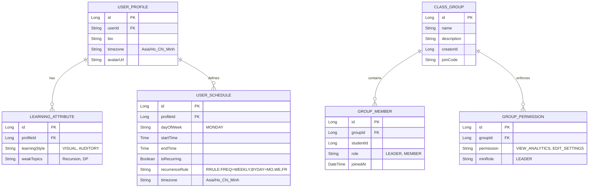

# User Profile Service

## 👤 Overview
The **User Profile Service** manages extended user information, learning preferences, and educational background. It serves as the central repository for student and teacher profiles.

## 🏗 Architecture & Design
This service follows a **Layered Architecture** (Controller -> Service -> Repository).

### Design Patterns & SOLID

#### 1. Builder Pattern (Profile Creation)
*Problem*: User profiles have many optional fields (social links, preferences, attributes).
*Solution*: Use Lombok's `@Builder` or a custom Builder to construct objects cleanly.
```java
UserProfile profile = UserProfile.builder()
    .userId("123")
    .educationLevel("Undergraduate")
    .addInterest("Java")
    .addInterest("AI")
    .notificationSetting(email, true)
    .build();
```

#### 2. DTO Projection (Repository Pattern)
*Problem*: We often need only a subset of data (e.g., "Student Name + Avatar") for lists, not the full profile.
*Solution*: Use Spring Data Projections or DTOs to fetch only necessary fields.

### Entity Relationship Diagram (ERD)
Reflecting **Schedules**, **Diagnostics**, and **Group Permissions**.



### RabbitMQ Bindings & Events
| Event | Exchange | Routing Key | Queue (Consumer) | DLX/DLQ |
|-------|----------|-------------|------------------|---------|
| `GROUP_JOINED` | `its.topic.exchange` | `profile.group.joined` | `q.course.enrollment` (Java) | `its.dlx.exchange` -> `q.dlx.all` |
| `USER_REGISTERED` (Consume) | `its.topic.exchange` | `identity.user.registered` | `q.profile.create` (Java) | `its.dlx.exchange` -> `q.dlx.all` |

### Acceptance Criteria & Flows
- **Profile Creation**:
    - Trigger: `USER_REGISTERED` event.
    - **Success**: `UserProfile` entity exists in DB with matching `userId`.
- **Group Joining**:
    - User enters `joinCode` -> `GROUP_MEMBER` created -> `GROUP_JOINED` event published.
    - **Success**: User appears in Group Member list; Course Service auto-enrolls user.
- **Schedule Management**:
    - User saves schedule in `Asia/Ho_Chi_Minh`.
    - **Verify**: API returns times correctly converted from UTC storage.

### Group Permissions (MinRole)
- `VIEW_ANALYTICS`: Requires `LEADER` or `TEACHER`.
- `EDIT_SETTINGS`: Requires `LEADER`.
- `POST_ANNOUNCEMENT`: Requires `MEMBER` (if allowed) or `LEADER`.

## 🔗 Service Dependencies
- **Identity Service**: Receives user creation events to initialize profiles.
- **Course Service**: May be queried to update learning goals based on course availability.
- **Dashboard Service**: Provides data for the user dashboard.

## 🔑 Key Features
- **Profile Management**: Store and update name, age, education level, interests.
- **Learning Settings**: Manage learning goals, preferred languages, and schedule.
- **Diagnostic Info**: Store results of initial diagnostic tests.

## ⚙️ Configuration
| Property | Description | Example |
|----------|-------------|---------|
| `server.port` | Service Port | `8081` |
| `spring.datasource.url` | Database URL | `jdbc:postgresql://localhost:5432/profile_db` |

## 🚀 How to Run
1. Ensure PostgreSQL is running.
2. Run the service:
```bash
mvn spring-boot:run
```
