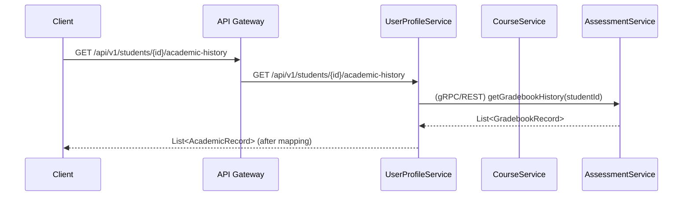

## Architectural Design: Student Management API

### 1. Architectural Approach

The proposed solution follows a **Service Aggregation** pattern within the existing microservices architecture. Instead of creating a new, standalone microservice, we will enhance the `user-profile-service` to act as the primary gateway for student management queries.

**Decision:** The new API endpoints (`/api/v1/students/{id}/**`) will be implemented in the **`user-profile-service`**.

**Reasoning:**
- **Cohesion:** The `user-profile-service` is already the source of truth for the core student identity (`UserProfile`, `studentId`). It is the most logical owner for an API that is centered around the student entity.
- **Efficiency:** This approach avoids the overhead of creating, deploying, and maintaining a new microservice. It leverages the existing infrastructure, CI/CD pipeline, and operational knowledge of the `user-profile-service`.
- **Centralization:** It centralizes the logic for student data aggregation, making the system easier to understand and maintain. The `dashboard-service` serves a different purpose: providing aggregated data for the *current user's* dashboard view. This new API is for managing *any* student, a task that fits better with the service managing user profiles.

### 2. Data Aggregation Flow

The `StudentController` will delegate requests to a new `StudentService`. This service will be responsible for orchestrating calls to other microservices to gather the necessary data.

### 3. Interservice Communication

Communication between the `user-profile-service` and the other services (`course-service`, `assessment-service`) will be implemented using **Feign clients** (declarative REST clients).

**Reasoning:**
- **Consistency:** The `dashboard-service` already uses Feign clients for interservice communication. Using the same technology maintains consistency across the codebase.
- **Simplicity:** Feign simplifies the process of making HTTP requests, reducing boilerplate code.

### 4. Potential Blockers & Dependencies

- **`course-service` API Gap:** The `course-service` currently exposes an endpoint for a student to get their *own* enrollments (`/my-courses`). A new endpoint may be required to allow the `user-profile-service` to query the enrollments for an arbitrary `studentId`. This will be the first implementation task to unblock the "Subjects" endpoint.
- **Authentication & Authorization:** The new endpoints must be secured. We will need to define which roles (e.g., `TEACHER`, `ADMIN`) have permission to access this data. This will be implemented using Spring Security annotations (`@PreAuthorize`) on the controller methods. The initial implementation will restrict access to authenticated users, with role-based restrictions to be added as a fast-follow.

### 5. Data Models (DTOs)

The `user-profile-service` will contain the full set of DTOs defined in the spec (`Student`, `AcademicRecord`, etc.). Mappers will be created to transform the responses from the downstream services into these DTOs. This ensures that the API contract is decoupled from the internal data models of the other services.
